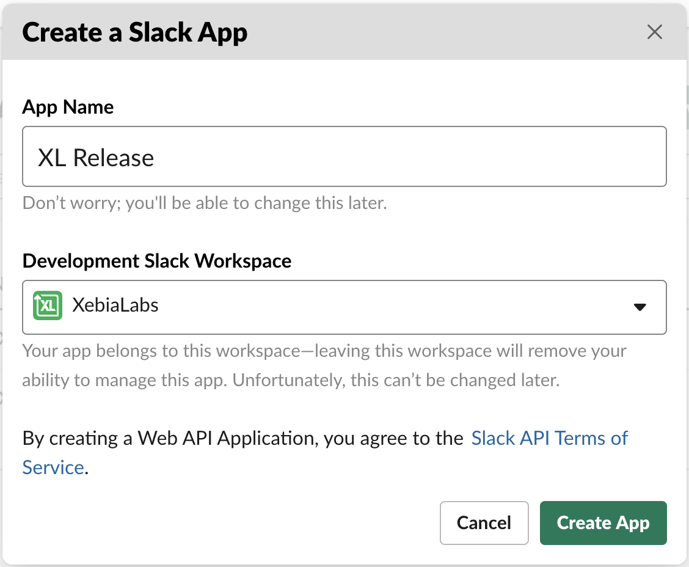
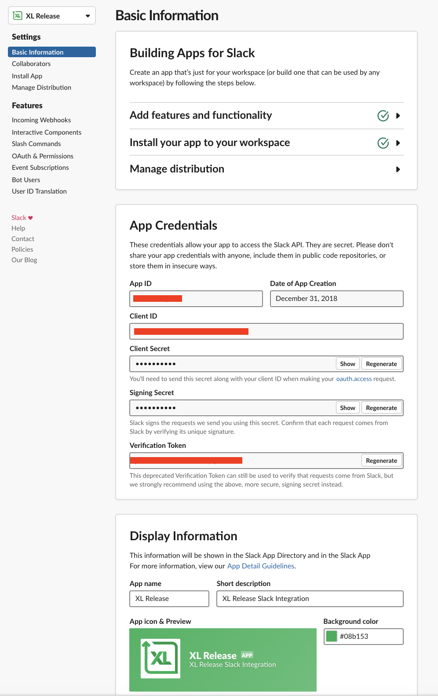
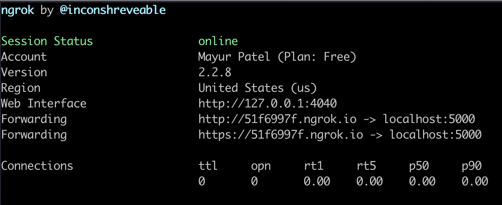
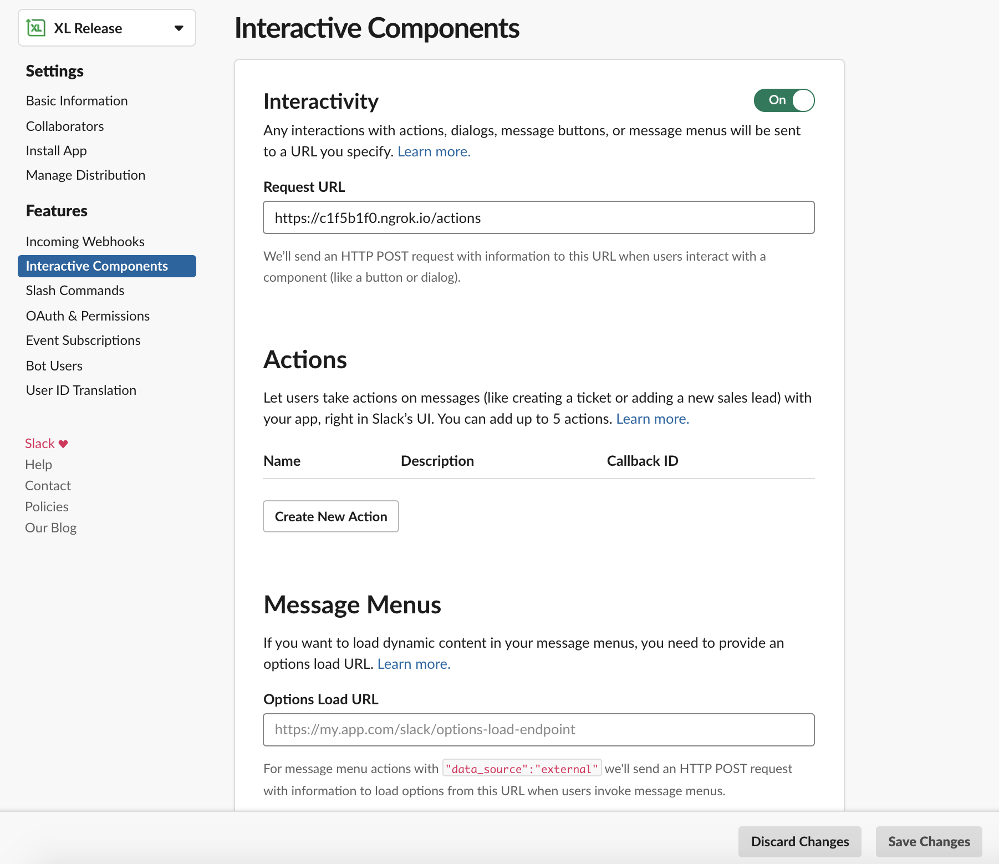
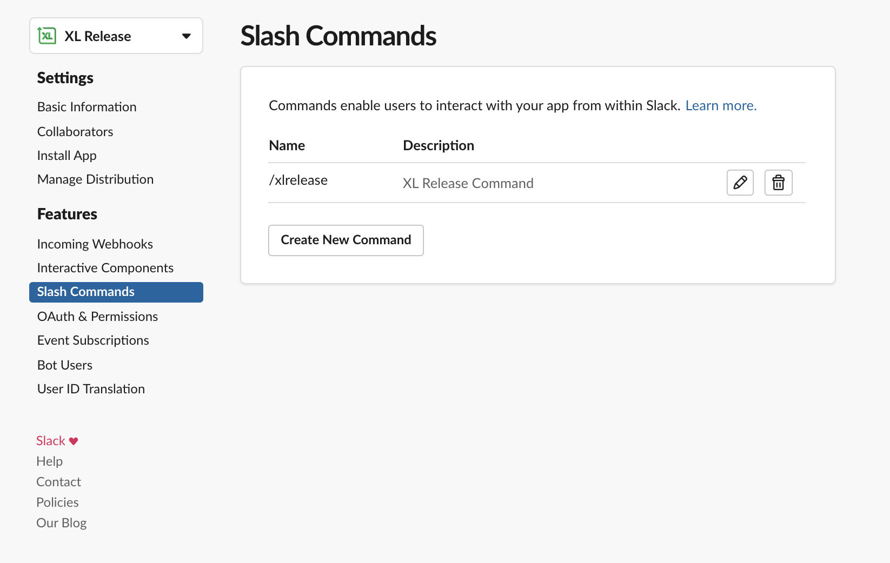
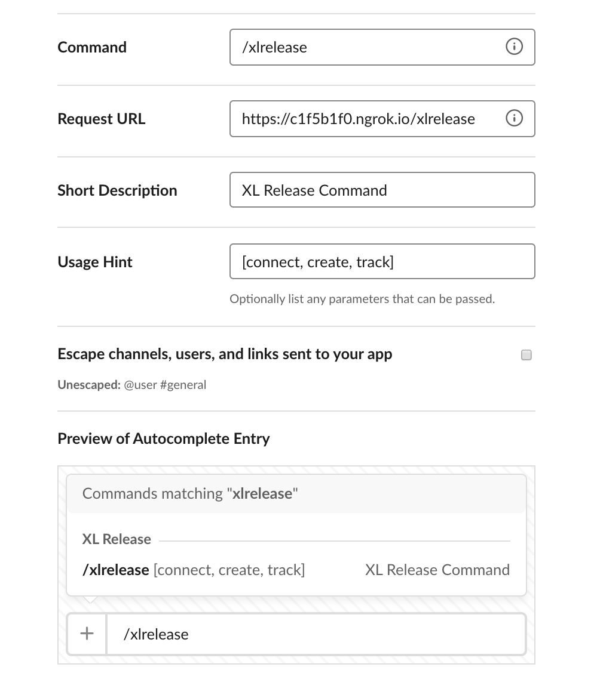
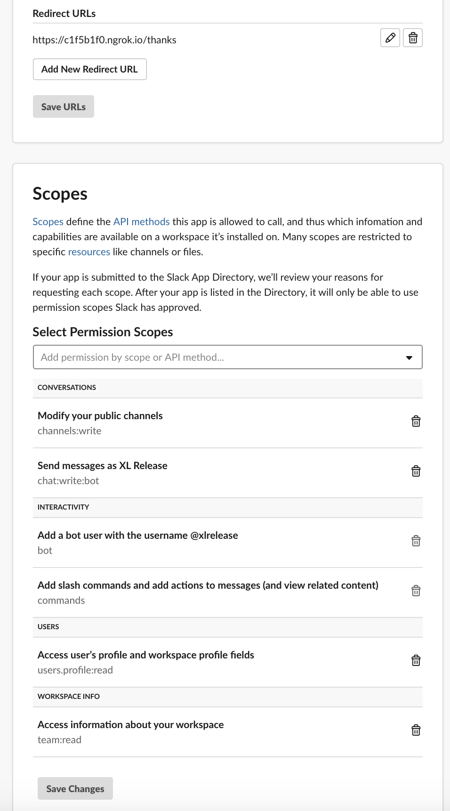
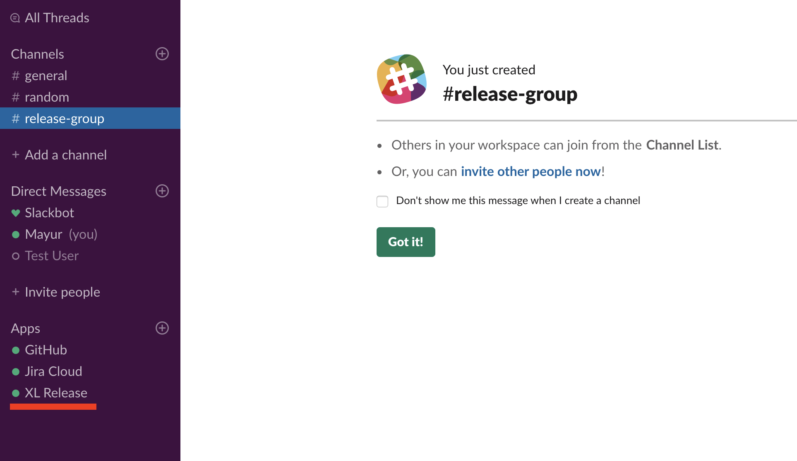
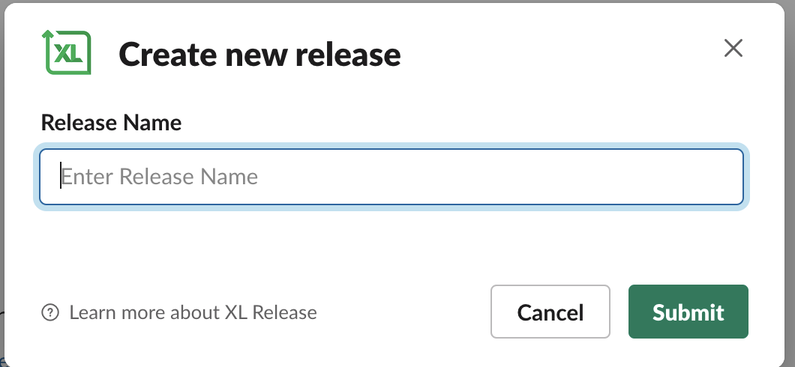
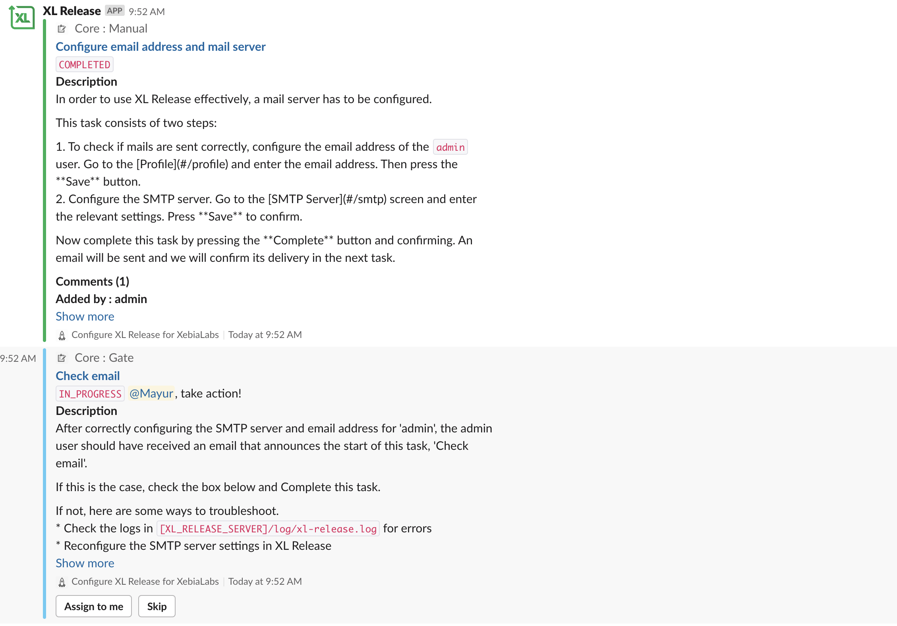

## CI status

[![Docker Hub][slack-xlreleaase-app-docker-hub-image] ][slack-xlreleaase-app-docker-hub-url]
[![License: MIT][slack-xlreleaase-app-license-image] ][slack-xlreleaase-app-license-url]


[slack-xlreleaase-app-docker-hub-image]: https://img.shields.io/badge/docker-ready-blue.svg
[slack-xlreleaase-app-docker-hub-url]: https://registry.hub.docker.com/repository/docker/xebialabsunsupported/slack-xlrelease-app
[slack-xlreleaase-app-license-image]: https://img.shields.io/badge/License-MIT-yellow.svg
[slack-xlreleaase-app-license-url]: https://opensource.org/licenses/MIT
# Preface

This document describes the slack-xlrelease-app implementation.

See the *XL Release Reference Manual* and [*Building Slack App*](https://api.slack.com/slack-apps) for background information on XL Release and Slack App.

# Overview

A slack app to create and track releases from Slack. This slack app will allow users to get status of tasks in slack and also take action on them.

## Installation

This slack app uses [Vault](https://www.vaultproject.io/) backed by [Consul](https://www.consul.io/) to store secrets. It also uses [Redis](https://redis.io/) as a database and cache.

You can use `docker/infra/docker-compose.yml` to spin up vault, consul, and redis.

It is recommended that you setup https for vault server. To do that, configure TLS Certificate and key path in `docker/infra/config/vault.hcl` and set `tls_disable = 0`

### Vault, consul, and redis setup

Change default `REDIS_PASSWORD` in `docker/.env` file. Now change directory to `docker/infra/`.

```
cd docker/infra/
```

For initial setup, follow below steps.

1. Start services: run `docker-compose up`
1. Init Vault: run `./scripts/setup.sh` This will create keys.txt in `docker/data` directory. Make sure nobody has access to it. Store *Vault Token* value in `docker/.env` file.

For subsequent runs, follow below steps.

1. Start services: run `docker-compose up`
1. Unseal Vault: run `./scripts/unseal.sh`

To take backup, run `./scripts/backup.sh`

To clean up everything, follow below steps.

1. Stop services: run `docker-compose down --volumes`
1. Clear persisted data: run `./scripts/clean.sh`

### Create Slack App

Now, we have to create slack app for XL Release.

* Visit [Slack Apps](https://api.slack.com/apps) and click on *Create New App*


* Add app name as *XL Release* and choose your development slack workspace.



* Once the new app is created, visit Basic information page and copy value of *Client ID*, *Client Secret*, and *Signing Secret* in `docker/.env` file. You can also customize icon for your Slack app from Display information page.



### Start Slack XL Release Bot

To start bot, execute below commands.

```
cd docker/app/
docker-compose build
docker-compose up
```

This will start slack bot on port 5000. However it is required to open tunnel to internet to communicate to slack app.

To do that, use [ngrok](https://ngrok.com) or setup reverse proxy using nginx or apache.

To use ngrok, run `ngrok http 5000` to open tunnel and copy the url which will be used to configure slack app.




### Configure features for your slack app

#### Add bot user

Click on *Bot Users* link from slack app configuration page and add username for your bot.


#### Configure interactive components

Click on *Interactive Components* link and add interactivity url.



#### Add slash command

Click on *Slash Commands* link and add new slash command as below.




#### Add events

Click on *Event Subscriptions* link and enable events. Add Request URL for events. Subscribe to _message.im_ event.


#### Add scope and permissions

Click on *OAuth & Permissions* link and add redirect url to thanks page. Also add scopes shown in below image.



### Install App in your workspace

To add slack app to your slack workspace, open bot url in web browser and click on _Add to Slack_ button and authorize the changes.


# How to Use

Once installed, you can see _XL Release_ in apps section.



Below commands can be used with this app.

`/xlrelease connect url username password`: Connect to XL Release i.e. `/xlrelease connect https://xlrelease.com admin admin`
`/xlrelease create`: Create a new release from templates
`/xlrelease track`: Track existing release

### Connect to XL Release

Each user has to configure their username and passwords to use this slack app. Don't worry, passwords are stored in Vault.

Enter below command in XL Release App Channel (You can use any channel) to configure your user.

`/xlrelease connect url username password`: Connect to XL Release i.e. `/xlrelease connect https://xlrelease.com admin admin`

You will get message shown in below screenshot if connection is successful.


### Create release from Slack

Use `/xlrelease create` command to create a new release from Slack. You will get a list of templates (based on access rights) to choose from.


Select any template and enter name for your release. Release will be create and it will show task which are in progress.




Note: _If release template requires other input variables, it will be shown with create release dialog. Right now only string type of variables are supported due to slack limitation._

You can now assign task to your self, complete the task, fail the task, skip the task or retry the task. Not all type of task actions are supported yet. For Gate task, user can only assign or skip task.

As release progresses, updated notifications are sent to slack channel.



### Track release from Slack

Use `/xlrelease track` command to track existing release. You will get a list of releases which are running (based on access rights) to choose from.
